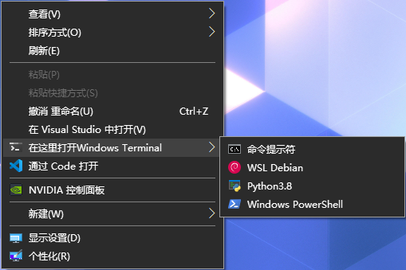
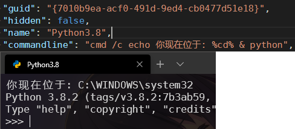

# 在这里打开Windows Terminal

## 使用效果

## 这个程序做了什么？
- 读取你的 Windows Terminal 配置
- 在 `%LOCALAPPDATA%` 中创建文件夹 `wtRightClick` 并写入配置文件（`Custom.json`、`Installed.json`）和图标 `terminal.ico`
- 向注册表写入内容
  |键|值|
  |:-|:-|
  |HKEY_CLASSES_ROOT\Directory\shell\MenuWindowsTerminal  HKEY_CLASSES_ROOT\Directory\background\shell\MenuWindowsTerminal  HKEY_CLASSES_ROOT\Directory\LibraryFolder\shell\MenuWindowsTerminal  HKEY_CLASSES_ROOT\Drive\shell\MenuWindowsTerminal  HKEY_CLASSES_ROOT\LibraryFolder\Background\shell\MenuWindowsTerminal|"MUIVerb"="%右键名称%" "Icon"="%LOCALAPPDATA%\wtRightClick\terminal.ico" "ExtendedSubCommandsKey"="Directory\\ContextMenus\\MenuWindowsTerminal"|
  |HKEY_CLASSES_ROOT\Directory\ContextMenus\MenuWindowsTerminal\shell\\%i%-%name%|"MUIVerb"="%配置别名%" "ExtendedSubCommandsKey"=- "Icon"="%配置图标%"|
  |HKEY_CLASSES_ROOT\Directory\ContextMenus\MenuWindowsTerminal\shell\\%i%-%name%\command|@="$(where wt.exe) -p \"%配置名%\" -d \"%V.\""|

## 十亿个为什么？
### 为什么要这样搞？
- cd c 到烦
- 
### 为什么用C# WPF
- 因为好用。

### 为什么用下载的ICO文件而不直接用Windows Terminal.exe
- 因为路径里面包含版本号（并且没有软链接(ljWindows)），路径会变。

### 在？图标？
- 懒！
